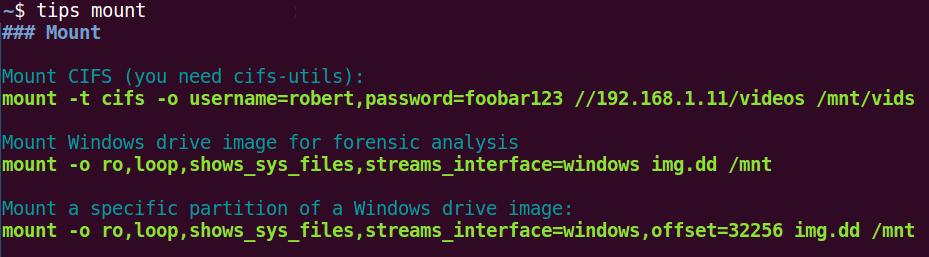

# Tips

Simple command line tool which display tips for some commands:



For now used with files in https://github.com/Te-k/commands-for-sec but you can configure another repository.

Feel free to improve the code or the tips

## Options

```
$ tips -h
Usage of tips:
tips COMMAND
  -c	List configuration
  -l	List available tips
  -pull
    	Pull new directory
```

## Configuration

Configuration is stored in ~/.config/tips with config being the configuration file and tips the tips repository (git repo). You can update the config file to use your own tip repository or manually manage it.
